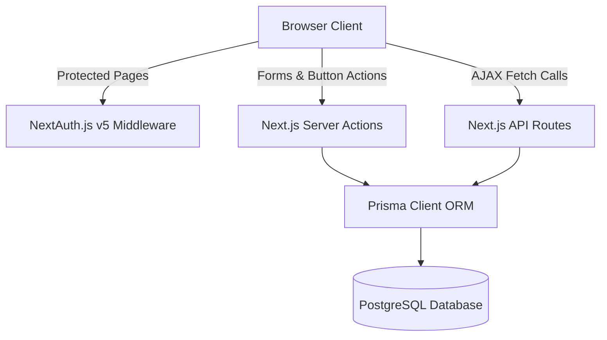

# Agapay - Tech Stack & Implementation Documentation (May 27, 2026)

This document provides a comprehensive technical overview of **Agapay**, a modern, responsive telehealth MVP designed for the Philippine healthcare context. It acts as a detailed system reference covering the frontend design, backend logic, database schema, project architecture, and third-party integrations.

---

## 1. System Architecture

Agapay is built on a full-stack architecture leveraging the **Next.js 15 App Router** framework. It uses a server-first rendering paradigm with interactive client-side React 19 components where needed.



### Key Architectural Characteristics:
* **Server-First Data Fetching**: User data, appointment lists, and medical records are loaded directly in server components and passed down as plain JavaScript objects to prevent data leakage and minimize client-side load time.
* **Server Actions as Mutations**: Form submissions, appointment approvals, and scheduling updates are handled through Next.js Server Actions, keeping API endpoints lightweight and co-located.
* **Session Guarding & Middleware**: Middleware intercepts requests to secure dashboard pages (`/patient/*` and `/doctor/*`) based on the authenticated user's role. Stale sessions from database resets are automatically cleared via `/api/auth/clear-stale-session` to prevent infinite redirect loops.

---

## 2. Technology Stack

| Layer | Technology | Details |
| :--- | :--- | :--- |
| **Core Framework** | Next.js 15.5 (App Router) | React 19, Server Components, Routing, Server Actions |
| **Authentication** | NextAuth.js v5 (Beta 25) | Credentials Provider with JWT session strategy |
| **Database ORM** | Prisma 5.22 | Client, migration CLI, schema definition, type-safe queries |
| **Database** | PostgreSQL 16+ | Relational data store for structured healthcare records |
| **Styling** | Tailwind CSS v3 & Vanilla CSS | Tailwind utilities combined with custom HSL-tailored branding |
| **Icons** | Lucide React | Modern, lightweight, vectorized medical and utility icon set |
| **Validation** | Zod | Schema-based validation on both the client (RHF) and server |
| **Form Handling** | React Hook Form | Declarative client-side form controls and resolver binding |

---

## 3. Database Schema & Data Model

The PostgreSQL database is managed via Prisma. The schema uses cascade deletion to clean up profiles and relation records when a user account is deleted.

### Model Definitions

#### 1. `User`
Tracks credentials, basic user profiles, and roles.
* `id` (String, UUID, PK)
* `email` (String, Unique)
* `passwordHash` (String)
* `name` (String)
* `role` (Role Enum: `PATIENT` or `DOCTOR`)
* `createdAt` / `updatedAt` (DateTime)

#### 2. `Patient`
Stores patient-specific details linked to a User account.
* `id` (String, UUID, PK)
* `userId` (String, FK, Unique) - References `User(id)`
* `dateOfBirth` (DateTime, Optional)
* `gender` (String, Optional)
* `bloodType` (String, Optional)
* `phone` (String, Optional)
* `address` (String, Optional)

#### 3. `Doctor`
Stores professional physician credentials and fees linked to a User account.
* `id` (String, UUID, PK)
* `userId` (String, FK, Unique) - References `User(id)`
* `specialization` (String) - e.g., Cardiology, Pediatrics, Pulmonology
* `licenseNumber` (String, Unique) - Professional PRC license number
* `bio` (String, Optional)
* `experienceYears` (Int) - Years active in clinical practice
* `consultFee` (Decimal) - Standard consultation fee (₱)

#### 4. `Appointment`
Models scheduled telemedicine consultations.
* `id` (String, UUID, PK)
* `patientId` (String, FK) - References `Patient(id)`
* `doctorId` (String, FK) - References `Doctor(id)`
* `dateTime` (DateTime) - Date and start time of consultation
* `status` (AppointmentStatus Enum: `PENDING`, `CONFIRMED`, `COMPLETED`, `CANCELLED`)
* `notes` (String, Optional) - Symptom description or booking notes
* `prescription` (String, Optional) - Medical prescriptions added by doctor
* `cost` (Decimal) - Charged consult fee
* `createdAt` / `updatedAt` (DateTime)

#### 5. `MedicalRecord`
Keeps patient diagnoses and historical clinic treatment charts.
* `id` (String, UUID, PK)
* `patientId` (String, FK) - References `Patient(id)`
* `doctorId` (String, FK) - References `Doctor(id)`
* `diagnosis` (String) - Formal diagnostic result
* `treatment` (String) - Prescribed therapy, drugs, or exercises
* `notes` (String, Optional) - Additional practitioner feedback

---

## 4. Key Functional Features

### 🔐 Authentication & Session Resiliency
* **Clean Session Clearance**: If the PostgreSQL database is re-seeded or wiped, users holding stale cookies are automatically caught by the server dashboards, redirected to `/api/auth/clear-stale-session` to flush browser cookies, and prompted to log in or register fresh.
* **Double-Hashed Passwords**: User passwords are encrypted with `bcryptjs` (using salt round 10) before storage.

### 🩺 Patient Portal
* **Dashboard Overview**: Displays upcoming appointments, past consultation history inside an interactive dialog popup, monthly health summaries, and wellness scores. 
* **Data Portability**: Patients can download their complete record summary directly to their local machine as a structured `.txt` export file.
* **Appointments Hub**: Features active tabs showing current and past bookings, a scheduling module with custom date/time selection, and Google Meet integration.
* **Digital Records Desk**: Supports record filtering by doctor name/specialty, drag-and-drop file uploading mock indicators, and full report view cards.
* **AI Symptom Assister**: Interacts with patients to review symptoms (e.g., dry cough) and highlights matches with HSL-tailored diagnostic suggestion blocks and compact vertical specialist cards.

### 🥼 Doctor Portal
* **Today's Queue**: Organizes active patient consultations for the current day with direct Google Meet connection URLs.
* **Google Meet Link Generator**: Formats Google Meet conference paths (e.g. `https://meet.google.com/xxx-xxxx-xxx`) dynamically from appointment IDs.
* **Appointments & Queue Managers**: Doctors can approve pending patient requests or reschedule them instantly.
* **Clinic Metrics**: Generates visual representations of patient traffic statistics, monthly revenue margins, and client satisfaction charts.

---

## 5. Folder Structure & Layout

The project files are modularized according to Next.js App Router conventions:

```
├── actions/                  # Next.js Server Actions (auth, appointments, doctors)
├── app/                      # App router directory
│   ├── (auth)/               # Authenticaton pages (login, register)
│   ├── (dashboard)/          # Secured layouts and dashboards
│   │   ├── doctor/           # Doctor dashboard page and schedule views
│   │   └── patient/          # Patient dashboard page, appointments, records, and AI chat
│   ├── api/                  # Route handlers (auth configuration, data endpoints)
│   │   └── auth/             # Stale cookie deletion handler
│   ├── layout.tsx            # Root HTML layout and global styles configuration
│   └── page.tsx              # Public-facing landing page
├── components/               # Shareable UI components (buttons, badges, inputs, layout containers)
├── hooks/                    # Reusable React hooks
├── lib/                      # Database configuration, validation schemas, utility helpers
├── prisma/                   # DB Schema and seeding script
├── types/                    # Extended TypeScript global declarations (e.g. NextAuth Session types)
└── utils/                    # Shared configuration models and assets
```

---

## 6. Development & Deployment

### Environment Setup
Create a `.env` file in the root directory:
```env
DATABASE_URL="postgresql://<user>:<password>@localhost:5432/<db_name>"
NEXTAUTH_SECRET="your-generated-jwt-secret-key"
```

### Script Directory Commands
* **Start Dev Server**: `npm run dev`
* **Build Project Bundle**: `npm run build`
* **Generate Prisma Client**: `npx prisma generate`
* **Push Schema to Database**: `npx prisma db push`
* **Run Database Seeds**: `node prisma/seed.js`
